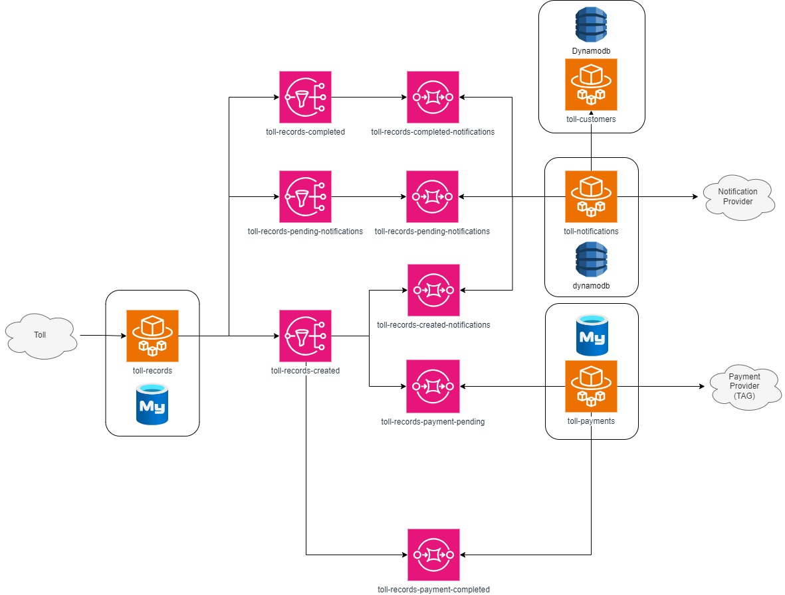

# Free Flow Projet

The Toll Freeflow System is designed to manage toll notifications, customer data, toll payments, and toll records using a microservices architecture. This project is built with Java Spring Boot and Spring Cloud, leveraging AWS Cloud resources including DynamoDB, SQS, ECS Fargate, and RDS with MySQL. 





This repository serves two main purposes:
1. To provide a comprehensive overview of the project.
2. To enable running the entire system locally using git submodules and Docker with LocalStack.

## Microservices
- **toll-notifications:** Manages notifications for toll events and payments.
- **toll-customers:** Handles customer-related data.
- **toll-payments:** Processes toll payments.
- **toll-records:** Manages toll event records.

## Repository Structure
- **toll-notifications:** [Link to repository](submodules/toll-notifications)
- **toll-customers:** [Link to repository](submodules/toll-customers)
- **toll-payments:** [Link to repository](submodules/toll-payments)
- **toll-records:** [Link to repository](submodules/toll-records)

## Getting Started
### Prerequisites
- Docker
- Git
- Browser

## Configuration

Add Submodules command 

```
git submodule add <repository-url> <directory>
``` 

Start Submodules

``` 
git submodule init
``` 

Update Submodule

```
git submodule update
```
